# Student Exam Score Data
## Overview

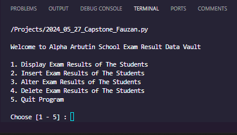

This is my submission for Capstone Project in Module 1 of Data Science Online Class. In this module, we are focusing on python programming language, hence the capstone project is to build a simple CRUD (Create, Read, Update, Delete) program with collection data type as the data manipulation approach. In my case, the business case I'm dealing with is a program to create, read, update and delete data of Exam Score of Student in a Highschool (in my case a fictional Alpha Arbutin High). I believe this program can be a stepping stone for anyone (including myself) to be better in python, especially for Data Science.

1. [Display Exam Results of The Students](#1-display-exam-result)
2. [Insert Exam Results of The Students](#2-insert-exam-result)
3. [Alter Exam Results of The Students](#3-alter-exam-result)
4. [Delete Exam Results of The Students](#4-delete-exam-result)
5. [Quit Program](#5-quit-program)

## 1. Display Exam Result
In this menu, there are two options, and one option to go back.

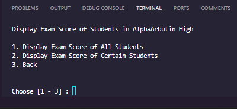

### Display Exam Score of All Student
This menu will display every students' data in Alpha Arbutin High 'Database' in a form of table. The table consists of Student's Data such as ID, NAME, GENDER, CLASS and EMAIL and also Student's Score of each subjects such as STATISTICS, OOP and BIOLOGY.

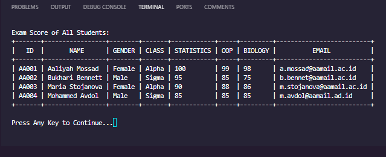

### Display Exam Score of Certain Student
This menu will display certain student(s)' data in Alpha Arbutin High 'Database' in a for of table, based on the user's selecton. User is allowed to choose which parameter to group the data of the student, be it based on single Student ID, Gender, or Class. For this, the menu will show another menu that allows user to choose parameter.

#### Display Exam Score option

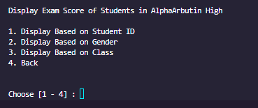

#### Display Exam Score Based on Student ID

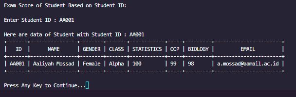

#### Display Exam Score Based on Gender

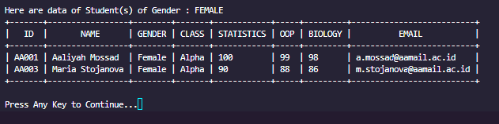

#### Display Exam Score Based on Class

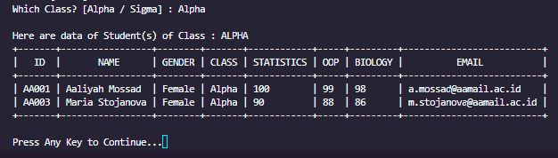

## 2. Insert Exam Result
This menu allows user to to insert new data to the Alpha Arbutin High 'Database', insertion data has to be started by input a Student ID which then followed by inserting the student's data and the student's score. The email is auto generated in this part by this format : [first letter (dot) second word @aamail.com] (e.g. Name = Fauzan Putra; EMail = f.putra@aamail.com)

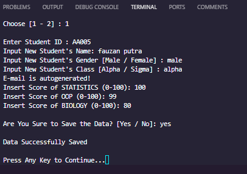

## 3. Alter Exam Result

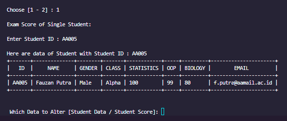

This menu allows user to alter a single data of Alpha Arbutin High 'Database', altering data has to be started by input a Student ID, user then will be given option to alter student's data or student's exam score. The student data option will only allow user to alter student's ID, NAME, GENDER, or CLASS. In altering mode, since the EMail is auto-generated, it is auto altered as well, by following the name. so if the name is altered, then the email is altered as well.

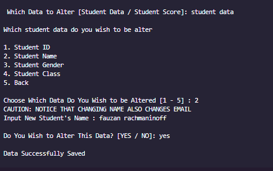

On the other hand, The student score option will only allow user to alter one student's subject exam score, which are STATISTICS, OOP, or BIOLOGY

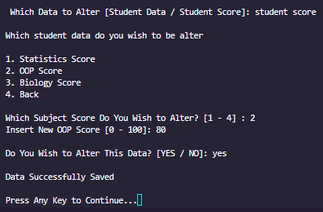

## 4. Delete Exam Result
This menu allows user to delete a single data of Alpha Arbutin High 'Database' based on the Student ID that is inputted by the user.

## 5. Quit Program
This menu allows user to quit from the application and brings back the normal Terminal
